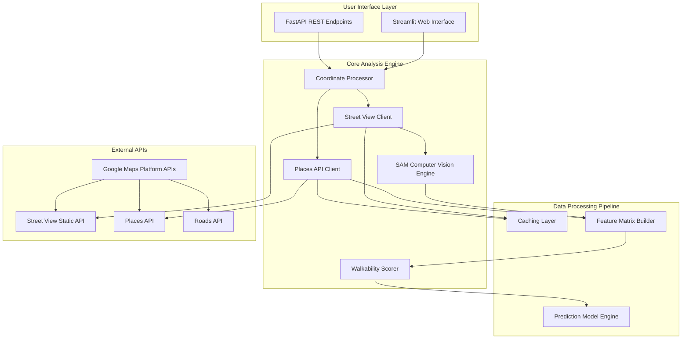

# Design Document

## Overview

This design merges the current Streamlit-based PEDS walkability application with the archived FastAPI-based Places API system to create a unified, comprehensive walkability analysis platform. The merged system combines interactive Street View computer vision analysis with robust geospatial data processing and sophisticated walkability scoring algorithms.

The architecture follows a modular approach where the Streamlit UI leverages the same core analysis engines as the API endpoints, ensuring consistency and maintainability while supporting both interactive and programmatic use cases.

## Architecture

### High-Level System Architecture



### Component Architecture

The system is organized into distinct layers with clear separation of concerns:

1. **Presentation Layer**: Streamlit UI and FastAPI endpoints
2. **Business Logic Layer**: Core analysis engines and processing modules
3. **Data Access Layer**: API clients and caching mechanisms
4. **External Integration Layer**: Google Maps Platform APIs

## Components and Interfaces

### 1. Streamlit Web Interface (`app/streamlit_app.py`)

**Purpose**: Interactive web interface for real-time walkability analysis

**Key Features**:
- Interactive map with location selection
- Street View parameter configuration
- SAM model selection and upload
- Places API configuration
- Real-time analysis results with visualizations
- Downloadable mask files

**Interface**:
```python
class StreamlitApp:
    def render_map_selector() -> Tuple[float, float]
    def render_configuration_sidebar() -> AnalysisConfig
    def display_analysis_results(results: WalkabilityAnalysis) -> None
    def handle_mask_download(masks: List[np.ndarray]) -> None
```

### 2. FastAPI REST Service (`app/api_main.py`)

**Purpose**: RESTful API for programmatic access and batch processing

**Endpoints**:
- `GET /health` - Health check and API key validation
- `GET /places/categories` - Available place categories
- `POST /analyze/location` - Single location analysis
- `POST /analyze/batch` - Batch analysis of multiple segments
- `GET /analysis/{analysis_id}` - Retrieve analysis results
- `GET /api/stats` - API usage statistics

**Interface**:
```python
@app.post("/analyze/location")
async def analyze_location(request: LocationAnalysisRequest) -> WalkabilityResponse

@app.post("/analyze/batch")
async def analyze_batch(request: BatchAnalysisRequest) -> BatchWalkabilityResponse
```

### 3. Street View Client (`core/street_view_client.py`)

**Purpose**: Handles Street View API interactions with caching and error handling

**Responsibilities**:
- Metadata validation and error guidance
- Image fetching with configurable parameters
- On-disk caching with TTL management
- Rate limiting and retry logic

**Interface**:
```python
class StreetViewClient:
    def fetch_metadata(lat: float, lon: float) -> StreetViewMetadata
    def fetch_image(lat: float, lon: float, config: StreetViewConfig) -> Image.Image
    def validate_api_access() -> ValidationResult
```

### 4. Places API Client (`core/places_client.py`)

**Purpose**: Comprehensive Places API integration with advanced categorization

**Responsibilities**:
- Nearby search with pagination
- Text-based search for specific amenities
- Place categorization with healthcare prioritization
- Distance calculations and density metrics
- Rate limiting and usage tracking

**Interface**:
```python
class PlacesAPIClient:
    def search_nearby_places(location: Location, radius: int, place_type: str) -> List[Place]
    def analyze_street_segment(segment: StreetSegment, radius: int) -> SegmentAnalysis
    def get_usage_stats() -> APIUsageStats
```

### 5. SAM Computer Vision Engine (`core/sam_engine.py`)

**Purpose**: Segment Anything Model processing for visual feature extraction

**Responsibilities**:
- Model loading with automatic type detection
- Automatic mask generation
- Mask post-processing and filtering
- GPU acceleration when available

**Interface**:
```python
class SAMEngine:
    def load_model(model_type: str, checkpoint_path: str) -> SamAutomaticMaskGenerator
    def generate_masks(image: np.ndarray) -> List[Dict]
    def create_overlay(image: np.ndarray, masks: List[Dict]) -> np.ndarray
```

### 6. Walkability Scorer (`core/walkability_scorer.py`)

**Purpose**: Comprehensive walkability scoring with configurable weights

**Responsibilities**:
- Multi-factor scoring algorithm
- Healthcare-prioritized weighting
- Density-based category scoring
- Score breakdown and explanation

**Interface**:
```python
class WalkabilityScorer:
    def calculate_segment_score(analysis_data: Dict) -> float
    def calculate_overall_score(segment_scores: List[float]) -> float
    def get_score_breakdown(analysis: PlaceAnalysis) -> ScoreBreakdown
```

### 7. Feature Matrix Builder (`core/feature_builder.py`)

**Purpose**: Combines visual and geospatial features into unified matrices

**Responsibilities**:
- Visual feature extraction from SAM masks
- API feature normalization
- Feature matrix construction
- Provenance tracking

**Interface**:
```python
class FeatureBuilder:
    def extract_visual_features(masks: List[Dict]) -> VisualFeatures
    def extract_api_features(places_data: Dict) -> APIFeatures
    def build_feature_matrix(visual: VisualFeatures, api: APIFeatures) -> FeatureMatrix
```

### 8. Caching Layer (`core/cache_manager.py`)

**Purpose**: Intelligent caching for API responses and processed data

**Responsibilities**:
- Street View metadata and image caching
- Places API response caching
- TTL management and cache invalidation
- Storage optimization

**Interface**:
```python
class CacheManager:
    def get_cached_street_view(lat: float, lon: float) -> Optional[CachedStreetView]
    def cache_street_view(lat: float, lon: float, data: StreetViewData, ttl: int) -> None
    def get_cached_places(location: Location, radius: int) -> Optional[CachedPlaces]
```

## Data Models

### Core Data Models

```python
@dataclass
class Location:
    lat: float
    lng: float

@dataclass
class StreetSegment:
    segment_id: str
    start_location: Location
    end_location: Location
    street_name: str
    length_meters: Optional[float] = None

@dataclass
class StreetViewConfig:
    size_w: int = 640
    size_h: int = 640
    fov: int = 90
    pitch: int = 0
    heading: Optional[int] = None

class PlaceType(str, Enum):
    HEALTHCARE = "healthcare"
    TRANSIT = "transit"
    AMENITY = "amenity"
    RETAIL = "retail"
    RESTAURANT = "restaurant"
    SERVICE = "service"
    ENTERTAINMENT = "entertainment"

@dataclass
class Place:
    place_id: str
    name: str
    types: List[str]
    location: Location
    rating: Optional[float]
    category: PlaceType
    distance_from_segment: Optional[float]
```

### Analysis Models

```python
@dataclass
class WalkabilityAnalysis:
    location: Location
    street_view_available: bool
    street_view_metadata: Optional[Dict]
    sam_masks: Optional[List[Dict]]
    places_analysis: PlaceAnalysis
    walkability_score: float
    score_breakdown: ScoreBreakdown
    processing_time: float
    api_calls_made: int

@dataclass
class PlaceAnalysis:
    segment_id: str
    total_places: int
    places_by_category: Dict[PlaceType, List[Place]]
    density_metrics: Dict[str, float]
    walkability_score: float
    analysis_timestamp: str

@dataclass
class ScoreBreakdown:
    overall_score: float
    category_scores: Dict[str, float]
    category_weights: Dict[str, float]
    density_ratings: Dict[str, str]
```

### Configuration Models

```python
@dataclass
class AnalysisConfig:
    street_view_config: StreetViewConfig
    sam_model_type: str
    sam_checkpoint_path: str
    places_radius: int
    places_types: List[str]
    scoring_weights: Dict[str, float]

@dataclass
class APIConfig:
    google_maps_api_key: str
    max_requests_per_minute: int
    max_requests_per_day: int
    cache_ttl_hours: int
    debug_mode: bool
```

## Error Handling

### Error Categories and Responses

1. **API Configuration Errors**
   - Missing or invalid Google Maps API key
   - Insufficient API permissions
   - Billing not enabled

2. **Street View Errors**
   - Location not available in Street View
   - API quota exceeded
   - Network connectivity issues

3. **SAM Model Errors**
   - Missing or incompatible checkpoint files
   - GPU memory issues
   - Model loading failures

4. **Places API Errors**
   - Rate limit exceeded
   - Invalid search parameters
   - Service unavailable

### Error Handling Strategy

```python
class ErrorHandler:
    def handle_api_error(error: APIError) -> UserFriendlyError
    def handle_street_view_error(status: str, metadata: Dict) -> StreetViewError
    def handle_sam_error(error: Exception) -> SAMError
    def provide_remediation_guidance(error: BaseError) -> RemediationSteps
```

## Testing Strategy

### Unit Testing

- **Component Tests**: Individual module functionality
- **API Client Tests**: Mock external API responses
- **Scoring Algorithm Tests**: Validate calculation logic
- **Configuration Tests**: Environment variable handling

### Integration Testing

- **End-to-End Workflow Tests**: Complete analysis pipeline
- **API Integration Tests**: Real Google Maps API interactions
- **UI Integration Tests**: Streamlit component interactions
- **Cache Integration Tests**: Caching behavior validation

### Performance Testing

- **Load Testing**: Multiple concurrent analysis requests
- **Memory Testing**: SAM model memory usage
- **API Rate Limit Testing**: Quota management validation
- **Cache Performance Testing**: Cache hit/miss ratios

### Test Structure

```python
# Unit Tests
tests/
├── unit/
│   ├── test_street_view_client.py
│   ├── test_places_client.py
│   ├── test_sam_engine.py
│   ├── test_walkability_scorer.py
│   └── test_feature_builder.py
├── integration/
│   ├── test_analysis_pipeline.py
│   ├── test_api_endpoints.py
│   └── test_streamlit_app.py
└── performance/
    ├── test_load_performance.py
    └── test_memory_usage.py
```

## Deployment Architecture

### Development Environment

- Local Streamlit development server
- FastAPI with auto-reload
- Local SAM model storage
- Environment variable configuration

### Production Environment

- Containerized deployment with Docker
- Load balancer for API endpoints
- Shared model storage (NFS/S3)
- Centralized configuration management
- Monitoring and logging infrastructure

### Configuration Management

```yaml
# docker-compose.yml
version: '3.8'
services:
  peds-app:
    build: .
    environment:
      - GOOGLE_MAPS_API_KEY=${GOOGLE_MAPS_API_KEY}
      - SAM_MODELS_DIR=/app/models
      - CACHE_DIR=/app/cache
    volumes:
      - ./models:/app/models
      - ./cache:/app/cache
    ports:
      - "8501:8501"  # Streamlit
      - "8000:8000"  # FastAPI
```